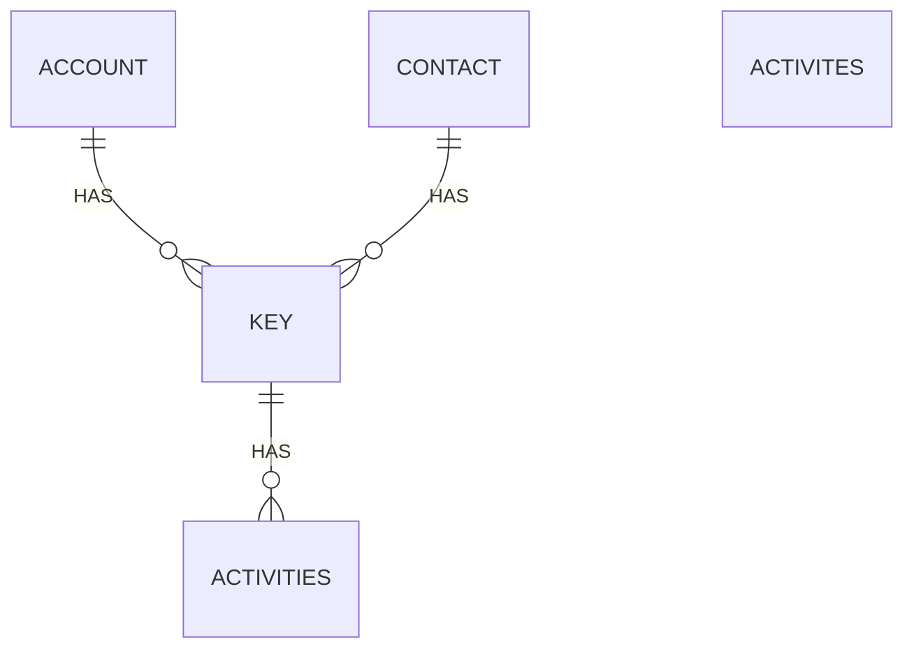

# Key Box
A solution for Microsoft Dataverse to administer login details of your organization.

## Features
 - Let you store keys directly inside Dataverse, directly beside the customers they belong to
 - Let you generate new passwords, based on the rules of your organization
 - Reminds you to renew the secret when a valid until or reminder date is set

## Security
 - As the data is stored in Dataverse, it is as safe as Dataverse
 - Security inside Dataverse can be defined with the Dataverse security model
 - All automations are build without compiled code, so that you can review it 
 
## Datamodel
### Table: bj_Key
User owned table
| Name | Type | Description
|--|--|--|
| bj_KeyId | Unique Identifier | The primary key of the table |
| bj_Name | Single line of text | A free text where you can give the record a name |
| bj_Description | Multiple lines of text | More space for notes | 
| bj_KeyTypeCode | Choice (local) | Lets you choose between 'Username & Password' and 'App ID & Client Secret'|
| bj_KeyIdentifier | Single line of text | The space for the username or App ID |
| bj_KeySecret | Single line of text | The space for the password or client Secret |
| bj_ValidUntil | Date | Note here the end of life of the secret |
| bj_RemindMeOn | Date | Set a date for reminder that pop up before the 'Valid until' date is reached |
| bj_CustomerId | Customer | A reference to the contact or account that belongs to the key |
| bj_Url | Single line of text  | A place for the URL where the key is used for |
| bj_IsMfaRequired | Boolean | Lets you mark that the key needs a second authentication factor |
| bj_MfaNote | Single line of text | Here you can write down notes about the second factor, like the used phone number. |

### Relations

